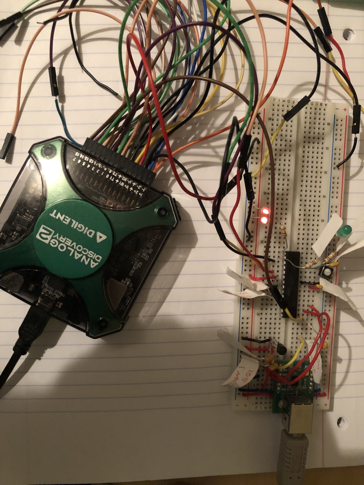

# AVR LED Mode Controller

Project intended to test implementation of a timer driving LEDs within a low power mode along with toggle switch driven interrupt that modifies the timer behavior.

## 📂 Improvements and Optimizations

1. I have decided to design the device with the goal of using the least power while adhering to the project requirements. Consequently, I have set the clock at the slowest reasonable rate as could be allowed while turning off all unused peripherals.
2. To keep with the goal of thhe lowest possible power consumption I decided to reconnect the LEDs to more suitable pins. The RED LED I connected to PIN9 PBI which is also the OC1A timer output pin. The other two LEDs I connected to a ssingle PIN10 PB2 which is OC1B (Output compare timer 1 B pin). With these connections the MCU can stay in low power mode while the timer toggles the pins in the background.
3. Reggarding the toggle switch I intend to add a 100nF capacitor in parallel with the MCU input pin as a means of debouncing in place of debouncing code.
4. The LEDs included a series 100k resistor which I wwould replace with 1k resistor to make the LEDs brighter.

## 📂 Repository Structure

The following are included in the repo to allow for working implementation and testing within the Wokwi simulator:

| File | Description |
| :--- | :--- |
| **`main.c`** | The primary source file containing the implementation.
| **`main.elf`** | The Executable and Linkable Format file generated by the AVR-GCC toolchain. |
| **`main.hex`** | The file containing the machine code ready to be loaded into the MCU. |
| **`diagram.json`** | The Wokwi hardware configuration file for simulation. |
| **`wokwi.toml`** | The simulator configuration file that links the virtual hardware to the `main.elf` artifact. |
| **`README.md`** | Project documentation and build instructions.

## 🛠 Build Instructions

### Prerequisites
* **AVR-GCC Toolchain:** Required to compile the C source into machine code.
* **avr-libc:** Standard library for AVR microcontrollers.
* **Wokwi VSCode Extension:** For hardware simulation.

### Compilation Commands
Go to the project root and execute the following commands in terminal:

1. **Compile the source:**
   ```bash
   avr-gcc -mmcu=atmega328p -DF_CPU=16000000UL -Os -Wall main.c -o main.elf

   
## 🧪 Testability & Build Configurations

This project supports two distinct build configurations to facilitate testing and production deployment:

### 1. Test-Build (Debug)
Used during development for step-through debugging and verification. Debug data are proviudedd thorugh UART via Serial Monitor
* **Flags:** `-O0 -g -DDEBUG`
* **Features:** Disables optimization and enables debug macros.
NOTE: The monitor_port will potentially have to be set in order to see debug messages in Serial Monitor

### 2. Release-Build (Production)
The final artifact optimized without UART debug messages.
* **Flags:** `-Os`
* **Features:** Optimizes for binary size and execution speed. Strips debug symbols to minimize Flash/RAM usage.

## 🛠 IDE Integration & Build Tasks

This project includes a pre-configured `.vscode/tasks.json` file. This allows for seamless switching between development directly within VS Code.

### How to Build
1. Open the project in VS Code.
2. Press `Ctrl+Shift+B` (or `Cmd+Shift+B` on macOS).
3. Select one of the following configurations:

| Task | Compiler Directive | Purpose |
| :--- | :--- | :--- |
| **Build: Debug** | `-O0 -g -DDEBUG` | Enables UART Debug messages and disables optimization. |
| **Build: Release** | `-Os` | Strips all debug logic and symbols. Optimizes for binary size and power efficiency. |

## 🧪 Assumptions and Tradeoffs 

1. First assumption is that, since I set the clock speedd so low, that the MCU doesn't have to perform additional tasks. The low clock speed would be a very significant hindrance. In setting the clock at so low speed I traded off power consumption for lowering the ability to perform other tasks.
2. Since there were 100k resistors in series with the LEDs, I expected that this would cause them to be very dim andd not visible at all. So, the assumption is that the LED light should be seen with a naked eye.

## 🧪 Real World testing

The firmware hass been tested on a atmega328p chip built basedd on breadboard and tested with Analog Discovery 2. The behavior corresponds to the Wokwi simulator.

<div align="center">
  
  <br>
  <em>Project atmega328p test board.</em>
</div>